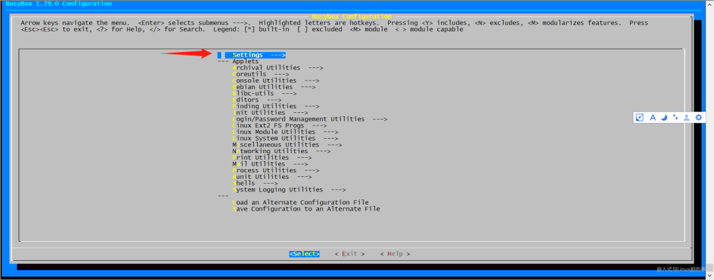
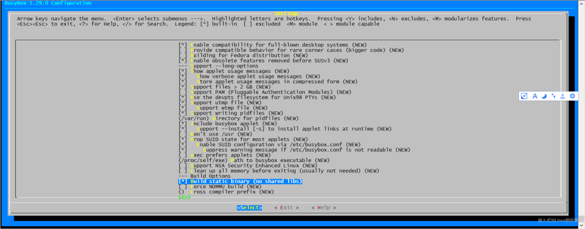

# 安装femu

```bash
git clone https://github.com/vtess/femu.git
cd femu
mkdir build-femu
# Switch to the FEMU building directory
cd build-femu
# Copy femu script
cp ../femu-scripts/femu-copy-scripts.sh .
./femu-copy-scripts.sh .
# only Debian/Ubuntu based distributions supported
sudo ./pkgdep.sh
./femu-compile.sh
```





# 安装busybox

```bash
wget https://busybox.net/downloads/busybox-1.32.1.tar.bz2
tar -xvf busybox-1.32.1.tar.bz2
cd busybox-1.32.1/
make menuconfig
```


```bash
make -j 8
# 安装完成后生成的相关文件会在 _install 目录下
make && make install
```

# 构建根文件系统

```bash

mkdir initramfs
cd initramfs
cp ../busybox-1.32.1/_install/* -rf ./
mkdir dev proc sys
sudo cp -a /dev/{null,console,tty,tty1,tty2,tty3,tty4} dev/
rm -f linuxrc
vim init
```

init中内容修改为

```
#!/bin/busybox sh
echo "{==DBG==} INIT SCRIPT"
mount -t proc none /proc
mount -t sysfs none /sys

echo -e "{==DBG==} Boot took $(cut -d' ' -f1 /proc/uptime) seconds"
exec /sbin/init
```

更改权限并打包

```
chmod a+x init
find . -print0 | cpio --null -ov --format=newc | gzip -9 > ../initramfs.cpio.gz
```

# 编译linux内核

```
make menuconfig
make -j 100
sudo make INSTALL_MOD_STRIP=1 modules_install
sudo make install
```

开启Compile the kernel with debug info选项，/arch/x86/boot/下会生成bzImage文件,当前目录下会生成vmlinux文件

# 使用gdb进行调试

启动qemu进行仿真

```bash
qemu-system-x86_64 -kernel ./arch/x86/boot/bzImage -initrd ../initramfs.cpio.gz -append "nokaslr console=ttyS0" -s -S -nographic
```

启动gdb，并连接，即可正常开始调试

```bash
gdb
(gdb) file vmlinux
(gdb) target remote localhost:1234
```


# vscode中添加支持

安装gdb拓展GDB Debug和GDB Debugger，并在.vscode目录下加入gdb.sh和launch.json

gdb.sh内容

```bash
#!/bin/bash

sudo gdb $@
```

launch.json

```json
{
    "version": "0.2.0",
    "configurations": [
        {
            "name": "kernel-debug",
            "type": "cppdbg",
            "request": "launch",
            "miDebuggerServerAddress": "127.0.0.1:1234",
            "program": "/home/yuhang/openeuler/kernel/vmlinux",//vmlinux文件所在目录
            "args": [],
            "stopAtEntry": false,
            "cwd": "${workspaceFolder}",
            "environment": [],
            "externalConsole": false,
            "logging": {
                "engineLogging": false
            },
            "MIMode": "gdb",
        }
    ]
}
```

即可开启可视化调试，在代码中打断点等